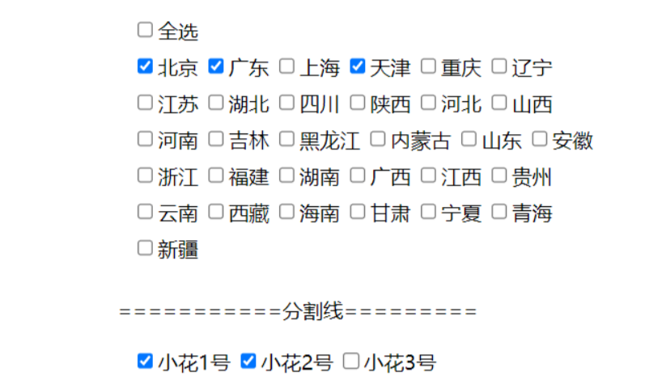

### 使用方法

> 在页面中需要使用的地方定义一个容器，给定一个id,这里我定义了两个

```
引入样式
<link href="css/checkboxContent.css" type="text/css" rel="stylesheet">
<div id="content1"></div>
<div style="margin:20px 0">===========分割线=========</div>
<div id="content2"></div>
```

> 引入jq和多选框源码，并执行实例。

```
<!--  引入jq-->
<script src="/js/jquery-3.6.1.min.js"></script>
<!-- 引入checkbox源码 -->
<script src="/js/checkboxContent.js"></script>
<script>
//执行一个实例，生成一个省份多选框， checkboxList 不传默认是省份
$("#content1").checkboxContent({
	 checkedValue:['北京','天津','广东'], //默认选中的多选框值,
	 showSelectAll:true, //是否显示全选按钮，默认true
	 key:0,  //唯一键，必传
	 getValue:function(res){   //选中值的回调
	 )
//  执行第二个实例
$("#content2").checkboxContent({
	checkedValue:['小花1号','小花2号'], //默认选中的多选框值,
	key:1,  //唯一键，必传
	showSelectAll:false,
 	checkboxList:[  //要渲染的多选框选项数组，默认值是省份
     {
         id:'xiaohua1',
         name:'小花1号'
     },
     {
         id:'xiaohua2',
         name:'小花2号'
     },
     {
         id:'xiaohua3',
         name:'小花3号'
     },
 ],  
getValue:function(res){   //选中值的回调
)
})
</script>

```

> 结果

